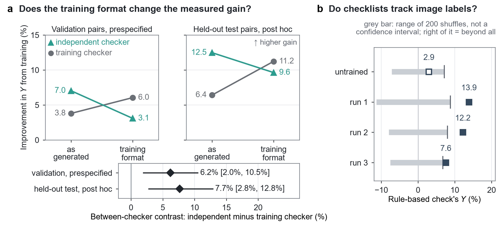

# Unmentioned Checklist Findings Change How Reinforcement Learning Appears to Improve Chest Radiograph Report Checking

Ali Vosoughi, Akhil Kasturi, Chenliang Xu, Axel Wismueller · University of Rochester

**Preprint, not yet peer reviewed:** [arXiv:2610.05425](https://arxiv.org/abs/2610.05425). Submitted to *npj Digital Medicine* (2026).

[](https://arxiv.org/abs/2610.05425)
[](LICENSE)


## Overview

A vision-language model looks at a frontal chest radiograph, never the report sentence under test, and fills in a
checklist of 12 findings. A separate checking model reads only the checklist and the sentence and decides whether the
sentence is supported. The checklist model is trained with reinforcement learning (GRPO) on matched pairs of CheXpert
Plus studies, and every saved checklist is evaluated by the checker used in training, an independent medical checking
model, and a rule-based check. Checklists often leave findings unmentioned, and how a checker reads an unmentioned finding
changes how much improvement it credits to training.

<p align="center">
  
</p>

## Key results

- On held-out patients, a rule-based check and an independent medical checking model, neither used in training, measured
  gains in discrimination (Youden index) of 12.6% and 11.8%.
- Switching to the training format, which fixes the finding order and enters unmentioned findings as absent, raised the
  training checker's measured gain and lowered the independent checker's: a difference of 6.2% in the prespecified
  comparison (95% interval 2.0% to 10.5%), repeated post hoc on held-out patients at 7.7%.
- Across 8 checking models, acceptance of a label-consistent negative statement about an unmentioned finding ranged
  from 1.0% to 97.0%.

Labels are extracted from report text and were not adjudicated by radiologists.

## Repository layout

| Folder | Contents |
|---|---|
| `train/` | GRPO training with verl, reward functions, training-data builders |
| `eval/` | writing and checking checklists, reference verdicts, checker rereads |
| `forms/` | checklist formats and the rule-based check |
| `stats/` | every analysis in the paper |
| `data/` | validation freeze, leakage and disjointness checks |
| `baseline/` | direct-supervision baseline |
| `configs/` | configuration files for the analyses |
| `harness/` | evaluation harness: model client, prompts, pair builder |
| `photo_study/` | the prespecified photograph study |
| `figures/` | figure builders |
| `pairs/` | pair and image identifiers only, no dataset content |
| `requirements/` | pinned Python environments |
| `docs/` | setup, data, reproduction steps, and details |

## Getting started

1. Obtain CheXpert Plus from Stanford AIMI, and COCO 2014 and VQA v2 for the photograph study
   ([docs/DATA.md](docs/DATA.md)).
2. Create the two Python environments from `requirements/` and download the models at their pinned revisions
   ([docs/SETUP.md](docs/SETUP.md)).
3. Set up the working directory:

   ```bash
   export CLAIMBLIND_ROOT=/abs/path/to/workdir
   export RADOPEN_ROOT=/abs/path/to/VerifyGRPO-Rad/harness
   bash setup_code_dir.sh
   ```

4. Follow [docs/REPRODUCING.md](docs/REPRODUCING.md) from data preparation through training, checklist reads, and
   statistics.

The jobs are Slurm batch scripts for NVIDIA GPUs; a training run uses three 48 GB GPUs for about 4 to 6 hours.

## Documentation

- [Setup](docs/SETUP.md): environments, environment variables, models and revisions
- [Data](docs/DATA.md): dataset access and what is not included
- [Reproducing the results](docs/REPRODUCING.md): every step from data to the paper's numbers, and compute
- [Photograph study](docs/PHOTO_STUDY.md): the prespecified study on everyday photographs
- [Figures](docs/FIGURES.md): figure inputs and builders
- [Code guide](docs/CODE_GUIDE.md): folder contents in detail, terms used in the code, prompts
- [File manifest](docs/MANIFEST.tsv): every file with its sha256

## Citation

If you use this code, the released checklists or the evaluation protocol, please cite the arXiv paper
([arXiv:2610.05425](https://arxiv.org/abs/2610.05425)):

```bibtex
@misc{vosoughi2026unmentioned,
  title         = {Unmentioned Checklist Findings Change How Reinforcement Learning Appears to Improve Chest Radiograph Report Checking},
  author        = {Vosoughi, Ali and Kasturi, Akhil and Xu, Chenliang and Wismueller, Axel},
  year          = {2026},
  eprint        = {2610.05425},
  archivePrefix = {arXiv},
  primaryClass  = {cs.CV},
  doi           = {10.48550/arXiv.2610.05425},
  note          = {Submitted to npj Digital Medicine}
}
```

## License

Code is released under the [MIT License](LICENSE). Datasets and model weights keep their own licenses and terms of use.
